# Model

Het staat model voor digitale tuintjes welke bij 'Het web is voor iedereen' door studenten worden gemaakt.

## Learning Log

Leg uit wat een source hosting platform is en voor welke jij gekozen hebt.
Een source hosting is een platform waaronder codeurs/ programmeurs hun code naar uploaden zodat ze in een omgeving remote met elkaar kunnen samenwerken. Op dit platform kan ej code uploaden, downloaden en elkaar pullrequest aanmaken en goed keuren. Zo kunnen ze van elke plek aan hetzelfde project werken maar ook tegelijkertijd.

Vertel welke domeinnaam jij gekozen hebt en hoe je die hebt gekoppeld aan jouw pagina.
Ik heb bloomingskilss gekozen omdat ik op deze oefenwebsite en eindopdracht mijn skilss gaat ontwikkelen. Daarbij vond ik de naam heel erg toepasselijk.

Beschrijf hoe je aanpassingen aan jouw pagina kunt maken en hoe je er voor zorgt dat die op het web gepubliceerd worden.
Als je een stukje code heb geschreven upload je die naar Github. In github zit er een ingebouwde hosting die ik aan mijn domein heb gekoppeld. Door mijn code te uploaden naar github de main branch. upload je gelijktijdig je code naar je website toe dat live staat.

### Maandag 21 september

Op deze dag ben ik bezig geweest met het maken van een liver version die tijdens de les werd uitgetyped, ben ik verder gaan werken aan me project en zijn we dieper ingeaaan over de cookie popup.
IK heb geleerd hoe je een cookie popup kan analyseren en dit ook kan toepassen. Daarnaast ehb ik geleerd wat dark patterns zijn.
Met de dark patterns zijn we de cookie popups van 3 websites gaan analyseren. (Bekijk de afbeelding hieronder).
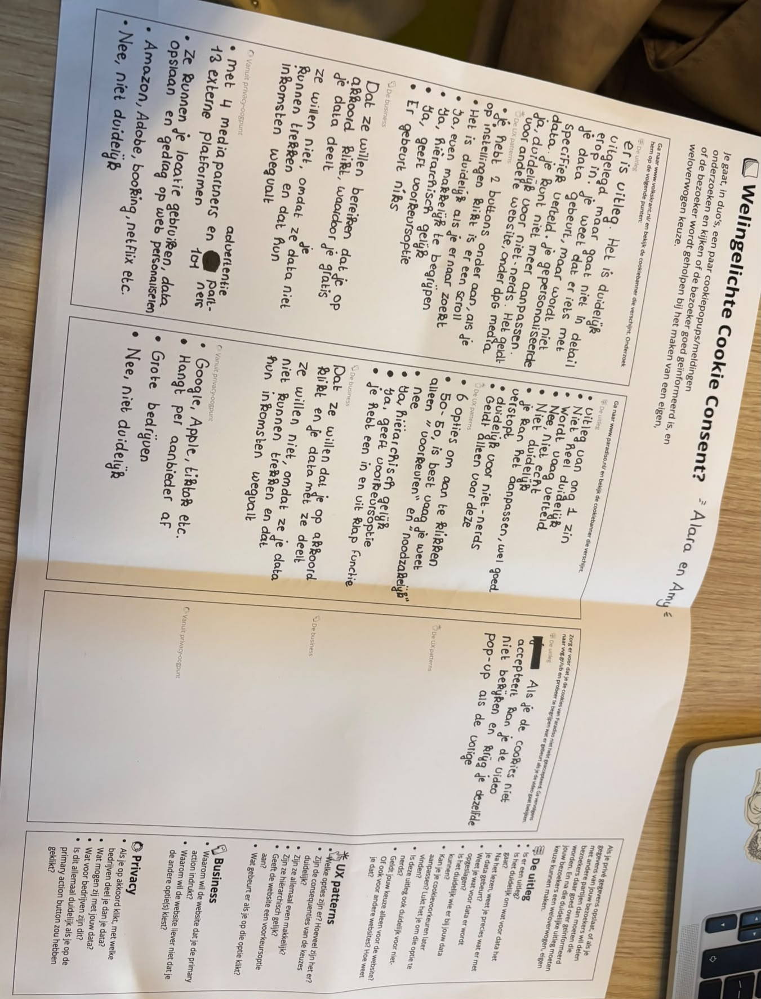.

Tijdens de les hebben we dit gemaakt 
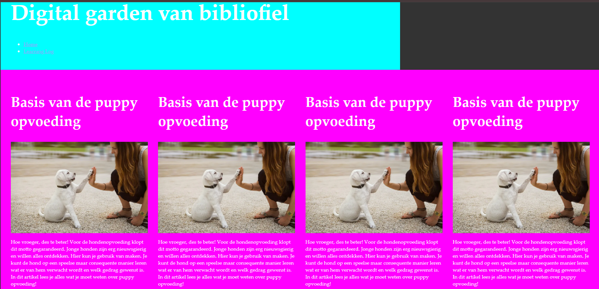.

Ik heb vandaag ook geleerd om te debuggen met code voor mijn digitale tuintje
IK heb namelijk met een merge conflict mijn code van de ladngspage / indexpagina kwijt geraakt.
Ik heb mezelf geleerd om te kijken naar de commits en daarin me code eruit te halen. Zo heb ik uiteindelijk het terug gekregen zoals het vrijdag het op github heb gepushed.

Wat zijn HTML landmark role elements?
De html role elements zijn de volgende tags:
- <head>
- Header
- Main
- Footer
Dit zijn de tags waarmee je de hiërarchie van een website bepaald en de html ook goed indeelt.

Wat zijn heading elementen en hoe horen deze 'genest' te worden?
De heading elements zijn de elementen zoals h1, h2, h3 en p tags waarmee je teksten een bepaalde hiërarchie kan geven in je html.

Hoe ga jij met cookies om? Beschrijf jouw beweegredenen en of die zijn veranderd na het volgen van dit college.
Soms als ik snel een website bezoek dan negeer ik al standaard de de cookies en accepteer ik deze niet. Ik heb nooit uitgebreid alles gelezen en zal dat ook niet gaan doen. Tijd kost nou eenmaal geld en veel tijd hebben we niet om alles door te lezen wat er met me data wordt gedaan. Ik zal wel alles meenemen in het maken van een website maar niet bij het gebruik van een website.

### Vrijdag 18 September
In de retrospective ben ik bezig geweest met het maken van een schets en het in beeld brengen van mijn proces. Hieronder vind je hoe ik mijn proces van sprint 1 heb ervaren.
Je krijgt makkelijk een beeld van wat een goede retrospective tekening is en ik heb dit verwerkt doormiddel van een tekning die ej hieronder kan vinden. 

De retospective van vrijdag
.
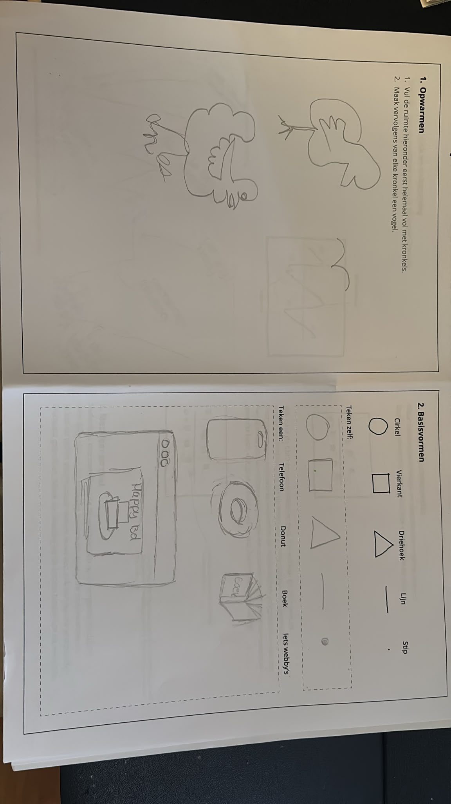.
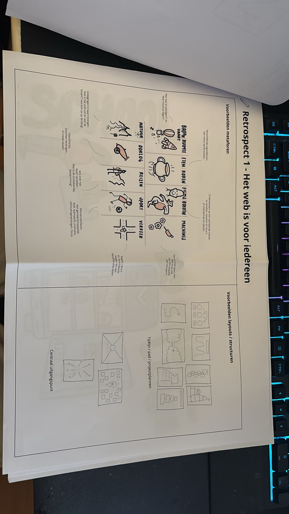.
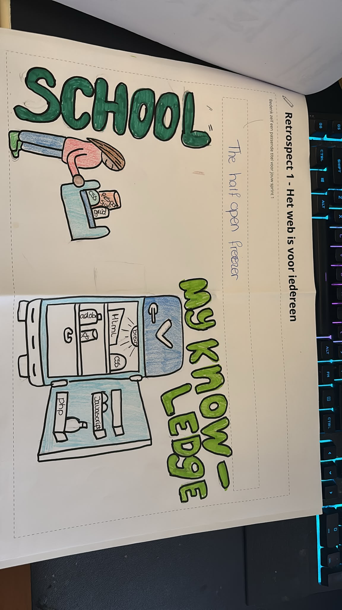.

Daarnaast hebben we ook retrospective gesprekken gehad waarin we hebben gekeken wat er verbeterd kan worden zowel in mijn process, learning log en mijn code.
Ik heb het naar mijn verwachting veel beter gedaan. De feedback die ik heb gekregen
- Het beter bijhoduen van me learning log
- design / schetsen erin zetten
- stukjes code toevoegen in mijn learning log

## orienteren en begrijpen
Waarom geven de docenten deze opdracht?
Ze willen dat we leren te coderen. Want later als je wilt gaan samen werken met codeurs / programmers dan weet je waar je over kan praten 

Welke technieken gebruik ik?
Ik maak gebruik van html, css en javascript. Ik heb mij digital garden gemaakt met html en css en daar een klein beetje javascript bij voor de theme function. Zo kon ik de theme buttons doorlinken aan de juiste thema. 

Wat zijn de randvoorwaarden?
Allereerst zijn er een aantal algemene randvoorwaarden waar je werk en proces aan moeten voldoen om in aanmerking te komen voor een voldoende beoordeling:

Je website staat tijdig op GitHub en werkt zonder fouten.
Je hebt voortgang besproken tijdens de voortgangsgesprekken.
Je hebt jouw proces inzichtelijk vastgelegd.
Je hebt je bronnen vermeld in je learning log en code.
Je hebt je werk zelf gemaakt*.
Je kunt keuzes/ideeën/code uitleggen.
Je hebt zelf nette code** geschreven.

Waar gebruik je HTML/CSS voor?
De html zorgt voor inhoud en de structuur. Je gebruikt het om te bepalen waar tekst, kopjes, afbeeldingen,labellen en knoppen op een webpagina.
Css zorgt voor  uitstraling en het uiterlijk voor  website. 

Wat kan er allemaal met CSS?
Met css heb je verschillende mogelijkheden hebben qua styling. Zo heb je color properties waarmee je gemakklijk een kleur kan aanroepen ipv dat je telkens de kleur code met oproepen. Dat geldt het zelfde voor custom fonts. Het beste is om 1 file te maken en deze kan je altijd importeren in verschillende style sheets. Je hebt ook de transition properties waarmee je dus dingen op de website kan animeren.

## verbeelden en conceptualiseren

Lukt het om verschillende ideeën te bedenken?
jaa het lukt wel om twee verschillende ideeën qua design te maken.

Lukt het om je ideeën te schetsen?
Ja het lukt wel met het schetsen op basis van me concept en het ideeën te verwerken erin. ik probeer in me schetsen duidelijk de starwars style naar voren te brengen.

Wat doet deze CSS-property?
je kan met verschillende properties verschillende dingen bereiken. Bijvoorbeeld mset css kan ej animaties, styling en mobiele websites maken. 
Met de properties kan ej dus meer dingen doen dan je denkt. Je kan dus alles maken wat ej maar kan bedenken.

Welke content, en welke HTML heb ik nodig?
Als je een html pagina wilt maken heb je natuurlijk content nodig. Dit kan je gaan schrijven i een html symmatieke manier van schrijven. 
Dat betekend dat je in je html file alles inzet wat je wilt hebben op je website.

Hoe kan ik dit soort content vormgeven?
Je kan dit soort contnt vormgeven doormiddel van een css style sheet. Dit is ee file waar al je design keuzes in komt te staan. Dit is eigenlijk de jas op je html. Het uiterlijk van je website.
Je kan dit maken door de stylesheet te linken aan je html-pagina. Zo krijg je kale html pagina een nieuwe uiterlijk.

Wat als ik hier nu eens 1000 invul?
Het tekenen en het schalen van je elementen per apparaat is heel belangrijk natuurlijk. Als je website te groot is voor bezoeker die op hun telefoon zitten dan is dast natuurlijk niet fijn.
dat is natuurlijk ook niet fijn als het andersom zo zijn. 
Daarom is het heel erg belangrijk dat je tijdens het verbeelden en conceptualiseren per apparaat alles goed schaalt en hier goed over nadenkt.

## Prototype en uitwerken
Begrijpen bezoekers de site?
Voor het uitbrengen van je website is het heel erg belangrijk dta je eerts begint met testen. Zo kan je kijken of je website voldoet aan een prettige ux ervaring.
Gebruikers komen niet op je website als de ervaring niet goed of fijn is. Daarom is het testen met de doelgroep hele belangrijk. Zo kan je dingen veranderen waar de gebruiker tegen aan loopt of niet fijn werkt. Zo krijg je uiteindelijk veel meer bezoekers op je website.

Wat vindt de opdrachtgever er van?
Vaak is het testen met en opdrachtgever heel verlichtend. Dit is je moment juist om aan de opdrachtgever te laten zien wat je gemaakt heb. Daarnaast zie je wat de opdrachtgever vind van wat je gemaakt heb.
Daarnaast is het testen voordat je naar een opdrachtgever gaat ook heel belangrijk is. Zo kan je zeker weten of je werk het goed doet voordta je iets gaat opleveren.

Werkt dit wel?
Je moet altijd testen wat je maakt. Zo weet je of de functionaliteiten die je maakt ook meteen werken. Dit is belangrijk want dan hoef je niet last minute alles te gaan testen in je project en kan je het meteen debuggen.

Oooooh, kan dit óók?!
Door het protetype en het testen kom je er vaak ook achter wat wel werkt en hoe je iets kan verbeteren. Dit geldt ook voor je css file en je coe hiervan. Je kan altijd met de feedback van anderen altijd leren en jezelf verbeteren.

## Evalueren
Reflecteren met the riddle:
Reflecteren si heel erg belangrijk. Omdat ik nog niet heel erg ver ben mety me project kan ik nog moeilijk evalueren op wat ik gemaakt heb. Ik kan wel het gaan evalueren op mijn process dta ik in de eerste sprint van twee weken gedaan heb. Aan de hand van de vragen kan ik mezelf iets bewuster maken van mijn process.

Wat wil(de) ik weten/bereiken?
Ik wil een functionele website kunnen maken in html en css. Hierbij wil ik ook een klein beetje javascript kunnen maken en dit terugkoppelen aan mijn code. Ik heb deze sprint geleerd hoe je op een andere manier kan gaan stylen en een mobiele versie eerst maken.

Wat heb ik gedaan?
Ik heb in deze sprint een theme choise page kunnen maken. een light/darkmode, een gradient button op hover, een tekst scrol animatie en met javascript heb ik de light en darkmode gemaakt waarmee die onthoudt wat je hebt gekozen met een localstorage. Dit is iets wat ik heb geleerd en dit heb toegepast op mijn digital garden over whatsapp.

Wat was het resultaat?
Ik heb eerst een beetje ermee moeten struggelen. Uitiendelijk is het me wel gelukt om dit toe tepassen. Ik heb ook geleerd op een andere manier te coderen en alles wat ik gewend ben moet ik effe loslaten en het nieuwe ervaren. 

Wat weet je nu (niet)?
Ik moet nog mijn teksten kunnen veranderen op basis van het thema. 

Wat vond je (niet) leuk?
Ik vond het concept wel lastig o met een concept te komen die ik zelf heel leuk vind om te maken. Hier heb ik een beetje mee gestruggled en ging het ook echt lastig mee.

Voldoet het nog aan de eisen?
Na kijken van eisen en de sprint review gesprek/ retrospective ben ik wel op een goede richting. Ik heb het evaluaren nog niet gedaan en het echte prototype van me code nog niet.

### Woensdag 15 september
Op woensdag zijn we bezig geweest met he verversen van je design en daar een nieuwe blik erop tegeven.
In een groepje van 4 keken we naar het design van elkaar en konden we hierop een nieuwe maken. Dit was de opdracht 18 tot 20.
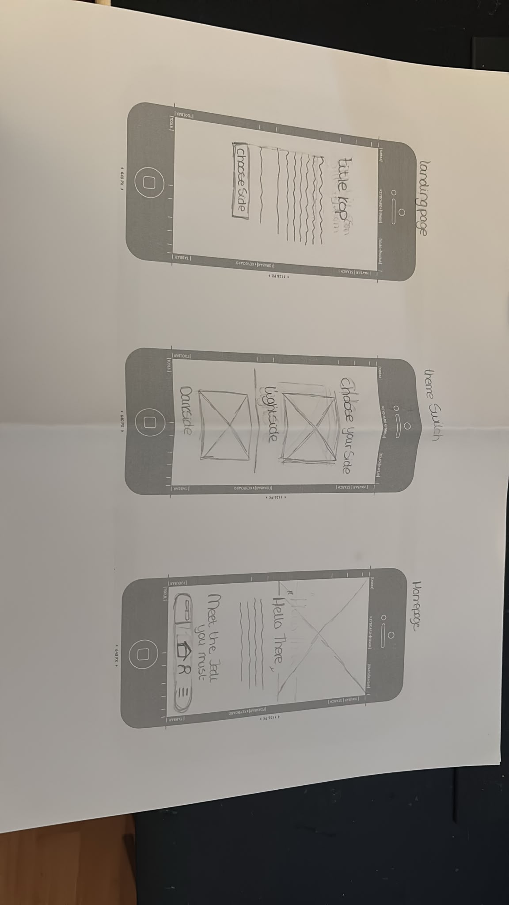.
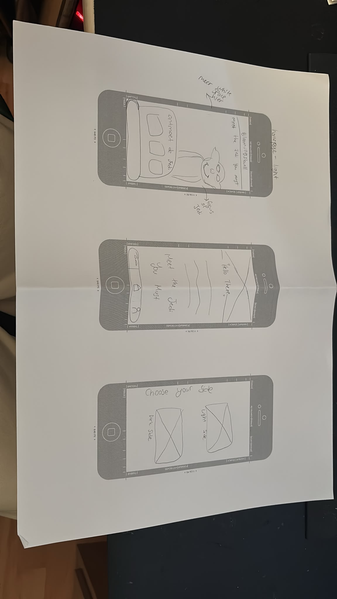.
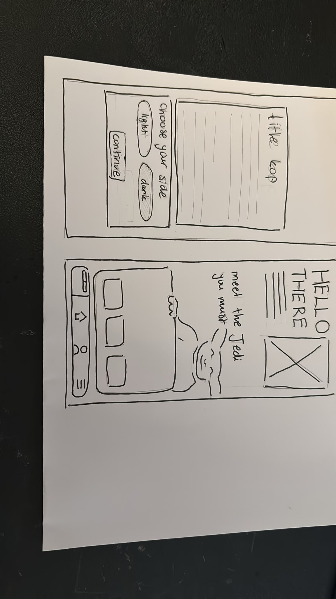.

WE hebben geleert wat de gestaltprincipes zijn en wat nou een grid is en hoe je dit kan toepassen in je code.
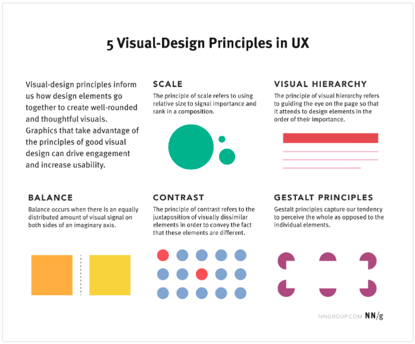
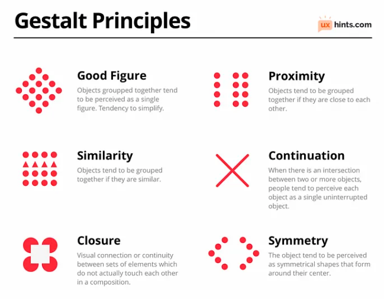

## checkout
Symmetry 
Brengt dingen goed samen en is hetzelfde styling

Nabijheid 
Het dicht opeen staans van elementen op een website

Witruimte
Dat er genoeg speling is tussen objecten op een website

Vraag 2
Dat er dingen goed te plaatsen en met te spelen zijn.
De websites elementen kan je makkelijk responsie maken.

Vraag 3
De witruimte en de Similarity. De ruimte is heel belangrijk in de websie want dan zijn elementen iets zichtbaarder

### Maandag 14 September
OP maandag hebben we in groepjes het gehad over de vormen van researching. We kregen in de les een blad met een Hoofdvraag daarop. Hierin moesten we deelvragen bedenken die het beste het onderwerp zouden beantwoorden. 

Op de foto zie je dat we de deelvragen hadden behandeld. De bladen werden omgewisself met een andere groepje. Bij hun vragen hebben de bijpassende onderzoeksmethoden besproken en opgeschreven. Zo wisten we welke onderzoeksmethode je hierop kan aansluiten en in welke scenario je dit kan toepassen.
 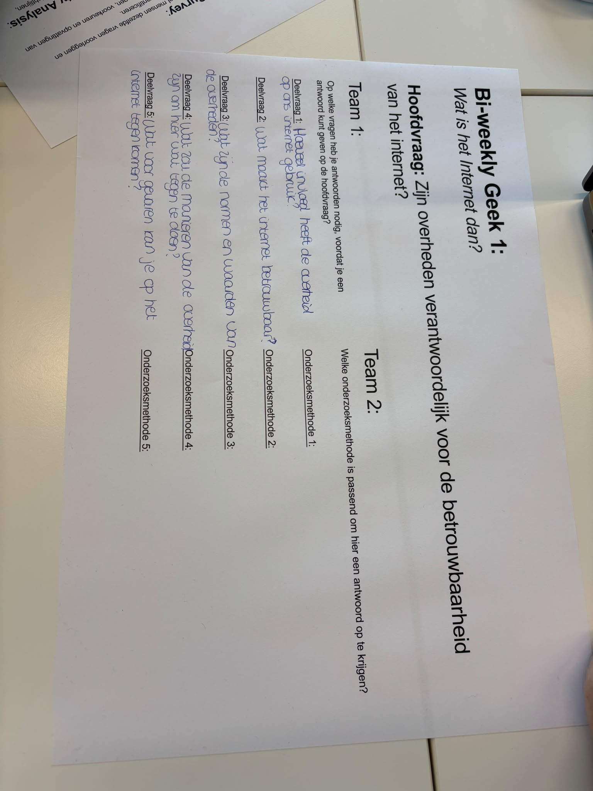.

Leg uit wanneer een website 'lelijk' wordt en geef voorbeelden wat je kan doen om deze 'lelijke' onderdelen te fixen?
Als elementen niet responsive zijn en alle afbeeldingen geen goeie grote hebben. En ook dat de styling niet bij elkaar past.
Je kutn mediaqueries gebruiken en in je code de website al een stuk responsive maken (Zoals het werken met procenten.)

Vertel welke volgende stap je neemt om je website responsive te maken.
Je moet eerst voor mobiel gaan designen dan pas naar de web versie.

Kun je het ontwerp en de bouw van je eigen Garden (zo uit je hoofd) onderbouwen in Webby vocabulair?
Ik maak me website meteen mobil first klaar.

### Vrijdag 11 september
Op vrijdag ben ik bezig geweest met het maken van de deep dive opdracht. In de deep dive opdracht van Sanne heb ik geleerd wat grid is en de children properties die je kan gebruiken om een grid item te stylen. Aan de hand van de oefeningen hieronder (De afbeeldingen als bewijs) zie je dat ik de stof heb opgenomen en dit heb toegepast in de code.
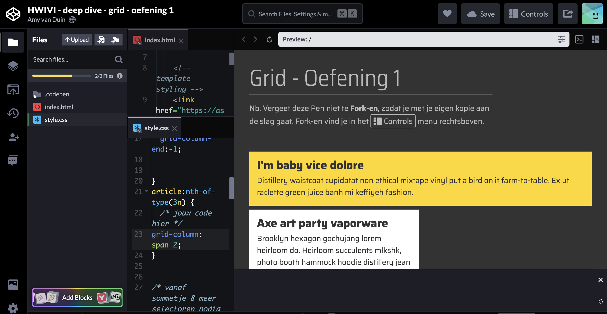.
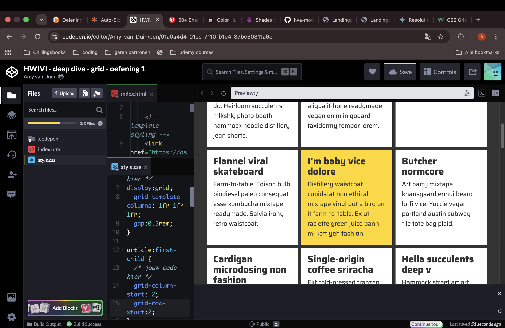.
.
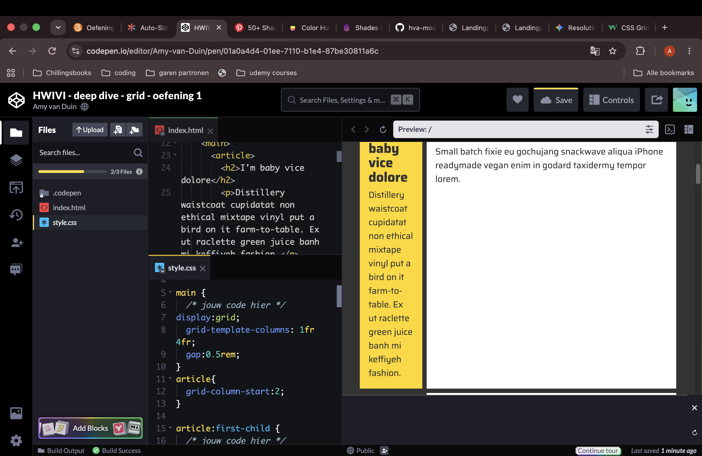.
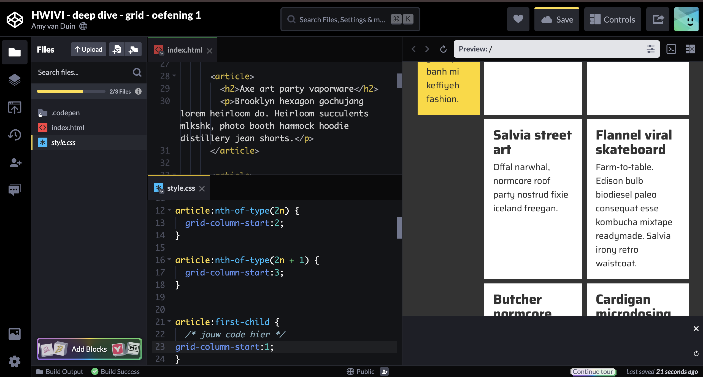.
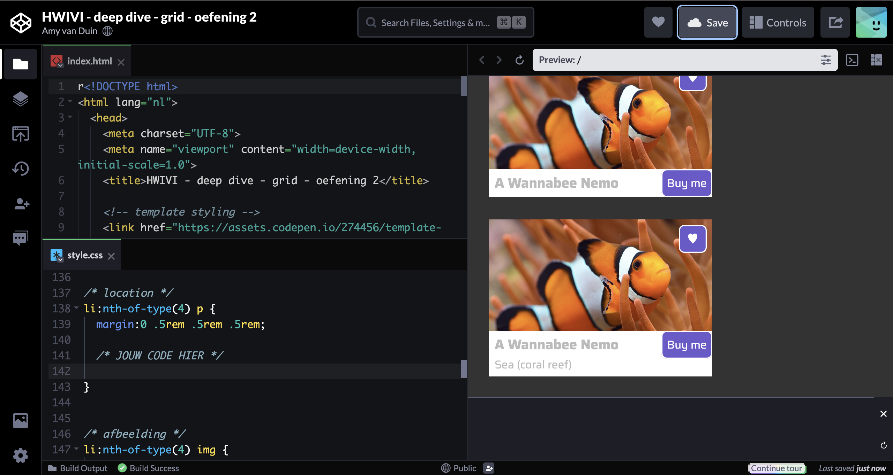.
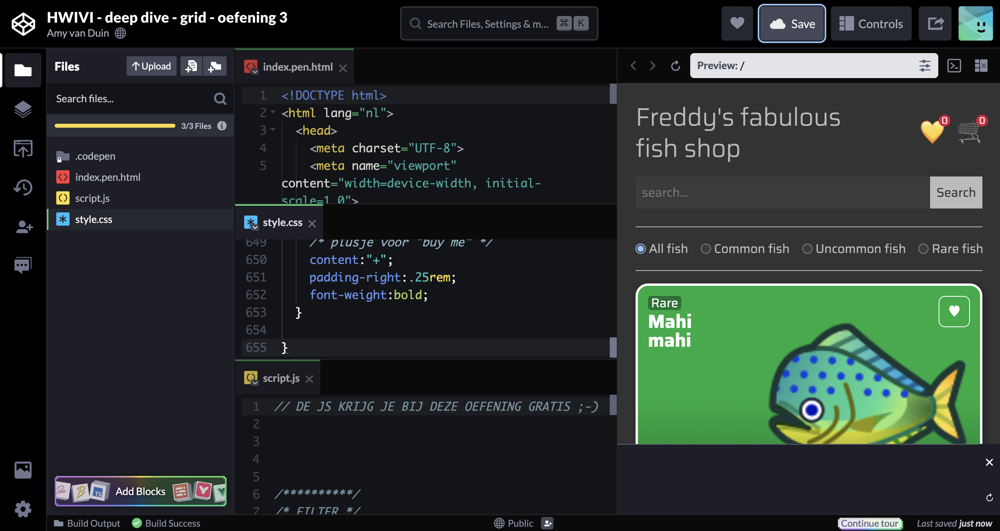.

### donderdag 10 september 2026
 Op deze thuiswerk dag ben ik gaan werken aan het huiswerk dat we gekregen hadden.
 - Schetsen verder afmaken
 - Mooie kleuren, gradients en patronen

Voor de Deepdive Mooie kleuren, gradients en patronen heb ik eleerd hoe je verschillende gradienst kan maken.

Dit was de eerts eoefening waarbij we 6 verschillende soorten gradients moesten namken. Hierin heb ik geleerd dat je verschillende soorten gradiensts heb en ze ook samen kan voegen. In deze oefening heb ik eerst de gradients geoefend.

De verschillende soorten gradients die je hebt:
- linear gradient
- radial gradient
- conic gradient
- repeating linear gradient
- repeating radial gradient
- repeating conic gradient

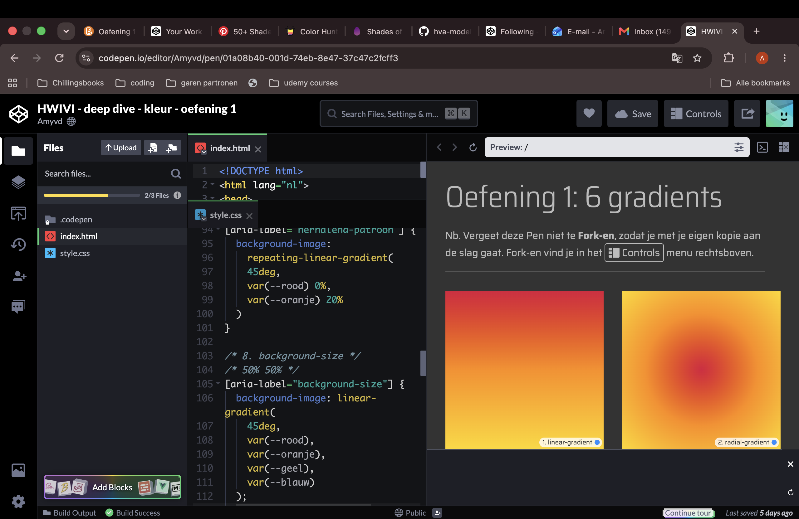.

In de oefening die je hieronder ziet heb ik geleerd om de verschillende soorten gradienst op elkaar te stappelen. Hieronder heb ik in de opdracht een vlag moeten namaken met css.
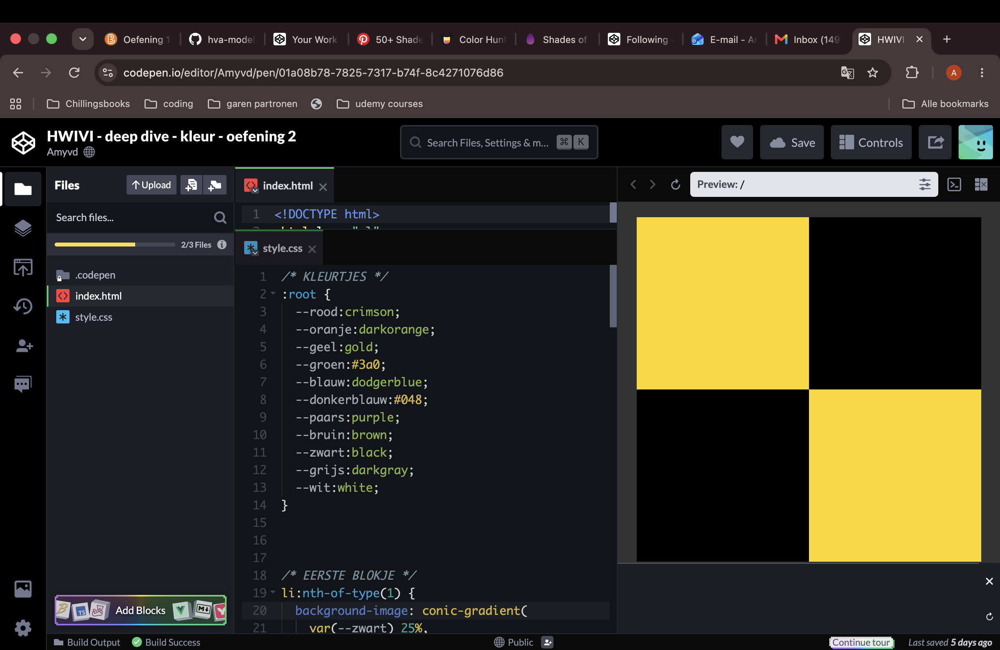.
.

In de opdracht hieronder kan je de gradient ook een transition geven. Ik heb dus geleerd om de gradient ook te kunnen animeren met de transition en transform.
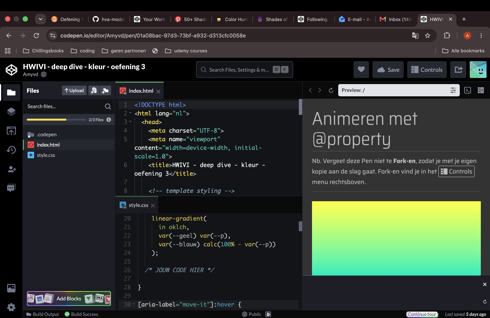.

### 9 september 2026
Op woensdag 9 september was er een staking met het ov. Hierdoor was er een online les en hebben we de volgende dingen behandeld
- presenteren van presentatie over onderwerp
- Visual Research maken
- De crazy 8
- De checkout

In het eerste gedeelte van de dag heb ik samen met analot de presentaties gedaan. We moesten in twee tallen de presentatie maken en wat vragen beantwoorden
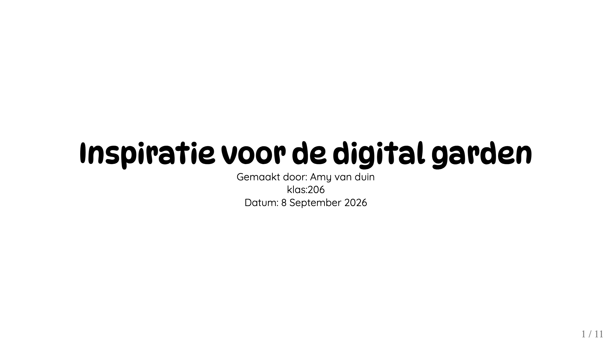.

# De vragen van de presentatie
Wat is voor jou de essentie van wat je hebt gepresenteerd qua onderwerp en geschreven/beeldende content?
De essentie is voor mij dat matcha meer is dan alleen een populair groen drankje. Ik wil de combinatie laten zien tussen de traditionele Japanse cultuur en het vakmanschap achter matcha en de moderne matchacultuur van nu. In mijn beelden komt vooral de bereiding, het matchapoeder, de materialen, beweging en de groene uitstraling terug.
 
Welke woorden uit de kwaliteitenlijst kunnen passen bij je onderwerp?
Woorden die goed bij mijn onderwerp passen zijn: rustgevend, natuurlijk, verfijnd, traditioneel, modern, fris, minimalistisch, zacht, stijlvol en ambachtelijk.
 
Heeft ‘de ander’ een aanvulling op je onderwerp?
Amy zei dat ze het leuk vind dat ik echt de wereld achter matcha wil laten zien. Zodat mensen het drankje niet alleen nemen omdat het een hype is maar omdat het ook echt voor iets staat.
 
Wat is het karakter/de uitstraling/het gevoel dat bij het onderwerp past?
Het gevoel dat ik bij mijn onderwerp wil neerzetten is vooral rustig, natuurlijk, fris en verfijnd. Tegelijkertijd wil ik dat het modern en stijlvol aanvoelt. De traditionele Japanse kant zorgt voor rust en vakmanschap, terwijl de moderne matchacultuur het wat speelser en eigentijdser maakt.
 
Welke inspiratie kun je uit de afbeeldingen halen? Stijl, gevoel, vorm, enz.?
Uit mijn afbeeldingen haal ik vooral inspiratie uit de groene en natuurlijke kleuren, organische vormen en structuren van het matchapoeder. Ook beweging komt veel terug, bijvoorbeeld bij het kloppen, schenken en mengen van matcha. De beelden voelen rustig en minimalistisch, maar tegelijkertijd modern. Voor mijn Digital Garden wil ik daarom veel werken met groentinten, wit/crème, grote beelden, ronde en organische vormen en een rustige vormgeving.

Wat zou je willen vertellen over het onderwerp aan een ander? En hoe zou je dat voor je kunnen zien? Middels welke beeld, tekst, animatie, inhoudelijke content?
Ik wil dit vooral visueel laten zien met veel afbeeldingen en eigen foto's. Daarnaast wil ik korte teksten gebruiken met informatie, mijn eigen ervaringen en mening. Ook wil ik bijvoorbeeld recepten, mijn favoriete matcha-spots, verschillende soorten matcha en korte animaties van het kloppen of schenken van matcha toevoegen. De Garden moet daardoor meer aanvoelen als een persoonlijke verzameling en inspiratieplek dan als een gewone informatieve website.
 
Ik wil mijn Digital Garden laten gaan over matcha en de combinatie tussen de traditionele Japanse matchacultuur en de moderne matchawereld, en wil dat laten zien doorveel afbeeldingen, eigen foto's, korte teksten, recepten en persoonlijke ervaringen aan content te tonen. Ik begin met een stukje eigen content over hoe ik zelf matcha maak, welke matcha ik lekker vind en mijn favoriete recepten. Als het begin is gemaakt kan ik mijn Garden verder uitbreiden door meer recepten, matcha-spots, informatie over de Japanse cultuur, verschillende soorten matcha, verpakkingen, materialen en nieuwe eigen foto's en ervaringen toe te voegen.

# Vragen van de tweede presentatie
Wat is voor jou de essentie van wat je hebt gepresenteerd qua onderwerp en geschreven/beeldende content? 
 Ik heb gekeken naar de infromatie die ik kon vinden en heb dit kunnen terugkoppelen naar de beeldende content. Ik heb de characters en de sfeer van de filmreeks terug laten zien in mijn collage en foto’s.

Welke woorden uit de kwaliteitenlijst kunnen passen bij je onderwerp? 
beeldend

Heeft 'de ander' een aanvulling op je onderwerp? 
Nee niet echt. Ze wist wel wat het was qua naam maar niet de storylines etcetra

Wat is het karakter/ de uitstraling/ het gevoel dat bij het onderwerp past? (bijv. stoer, hip, vrolijk, dynamisch, eenvoudig, enz.) 
Happy en boos. Ik heb vooral donkere afbeeldingen gebruikt over wat ik wilde tonen aangezien dit past bij de darkside.

Welke inspiratie kun je uit je 25 afbeeldingen halen. Stijl, een gevoel, vorm, enz. 
Heel nerdy stijl maar wel gewoon strak. Ik wil de website wel strak hebben en dat past binnen het thema van het onderwerp. 

Wat zou je willen vertellen over het onderwerp aan een ander? en hoe zou je dat voor je kunnen zien? middels welke beeld, tekst, animatie, inhoudelijke content? (bijv. Ik wil voornamelijk afbeeldingen tonen, als een soort Pinterest, of ik wil muziek fragmenten laten horen, of ik gebruik korte teksten met eigen foto's).  
Ik wil een soort info website maken dat je als een bezoeker doormiddel van een soort verhaallijn de website kan ervaren. Denk hierbij dat je baanweg door de website heen te lopen dat je dan daarna de informatie kan terug lezen doormiddel van text, images en aniamties.

Ik wil mijn digital garden laten gaan over star wars en wil dat laten zien door de gebruiker een verhaal te laten ervaren door dat via de content te tonen. Ik begin met een eigen stukje content over de light en darkside. Als het begin is gemaakt kan ik mijn garden verder uitbreiden door informatie te geven over de kant die je gekozen hebt.

# Visual research en Crazy eight
Na het maken en houden van de presentatie ben ik verder gaan werken aan de visual research opdracht. Met de visual Research opdracht breng je aan je onderwerp een sfeer beeld. Hierdoor ontdek je meerder en verschillende onderdelen die je kutn gebruiken voor je styleguide.

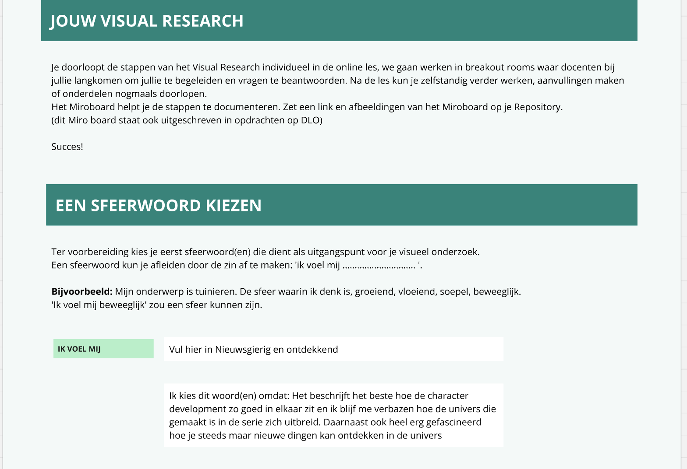.
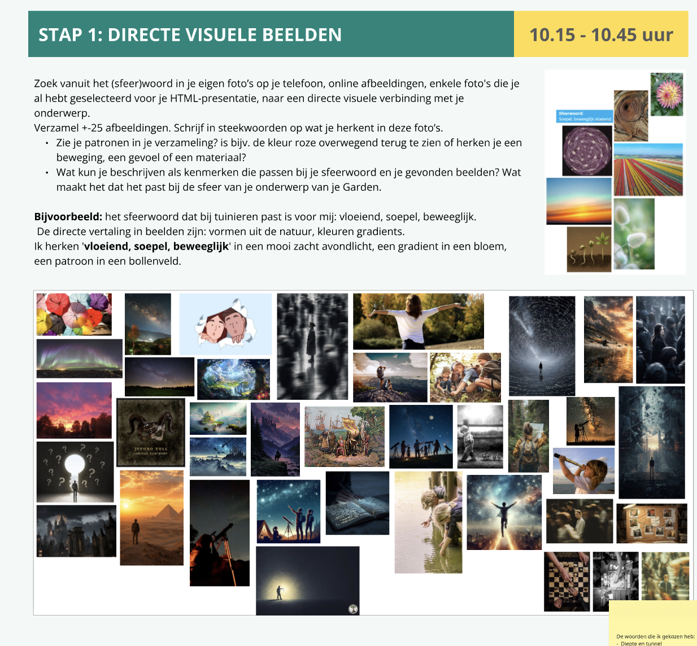.
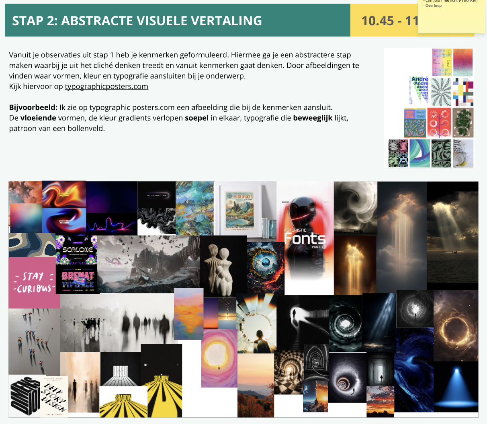.
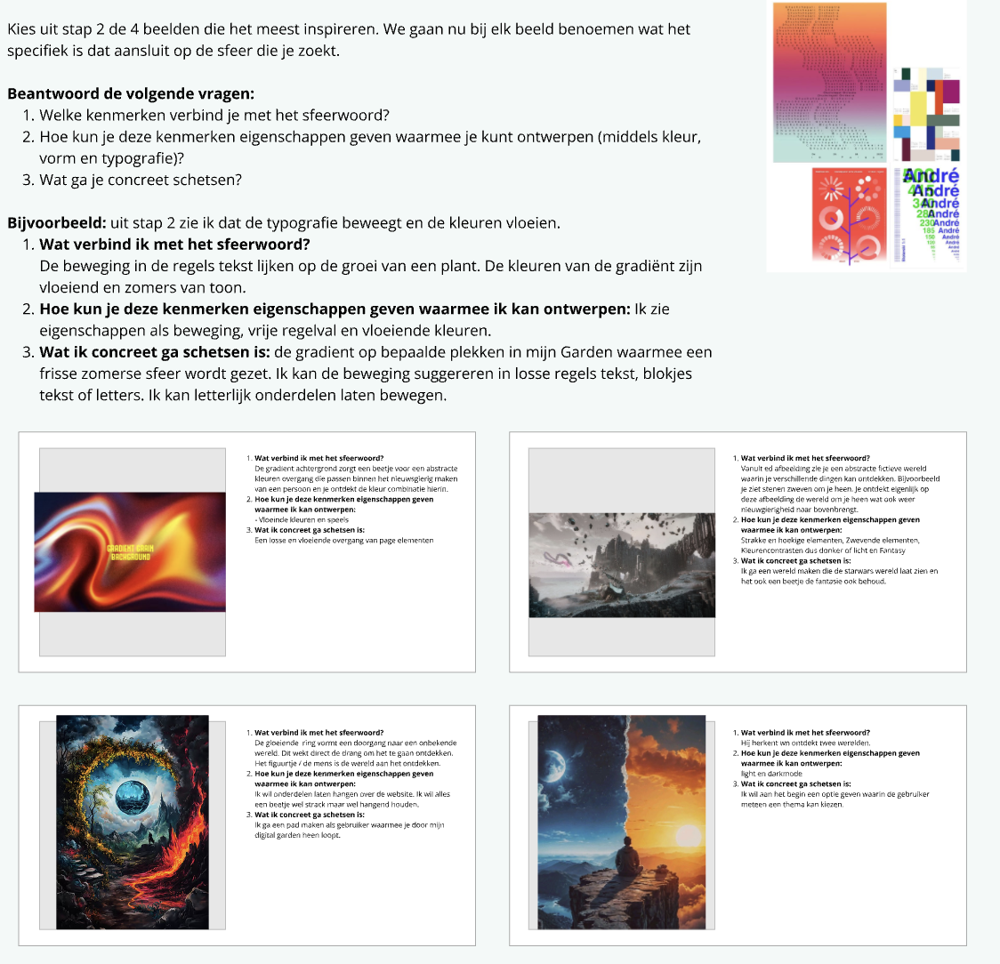.
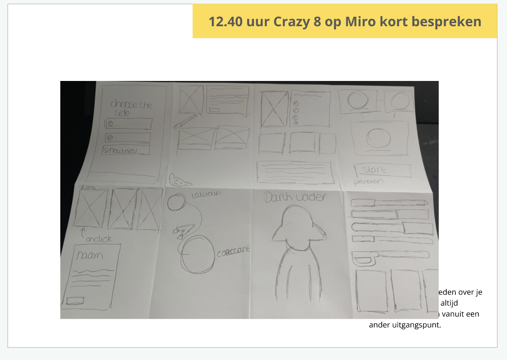.
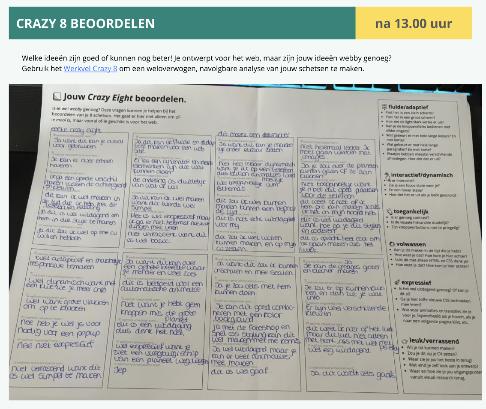.

# checkout 
Leg uit waar het Visual Research in 3 stappen naartoe werkt
Visual research werkt in 3 stappen:
- Direct beeld: Je zoekt direct plaatjes bij een sfeerwoord.
- Abstract maken: Je haalt de vormen, kleuren en lettertypes uit die beelden.
- Schetsen: Je gebruikt die abstracte elementen als vaste basis voor je eigen ontwerp.

Vertel in 2 zinnen waar jouw Garden over gaat, en met welke content je dat gaat doen (beeld, tekst, sound, animatie enz).
Ik ga mijn garden maken over de elementen van starwars die ik leuk vind. daarbij gebruik ik ene light en darkmodus die eigenlijk laat zijn hoe welke characters erbij passen en daar komt ook custom content terecht.

Vertel kort welk idee van de Crazy 8 je het liefst zou willen uitvoeren/ verder zou willen onderzoeken.
ik zou alle crazy eights willen uitvoeren. Dit is wel alleen afhankelijk of het haalbaar blijft.

### 7 september - les dag
Op maandag 7 september heb ik de volgende dingen gedaan
- Artikelen lezen over digital garden
- Begrijpen wat digital garden is.
- Het inschrijven op de deepdive naar intresse
- Rangschikken websites
- Onderwerp kiezen voor Digital Garden.

Om te bergijpen wat een digital garden is ben ik samen in een groepje van 4 andere mensen gaan kijken naar 5 verschillende artikelen. Hierin Heeft ieder 1 Artikel gelezen die gaan over Digital Garden. Vervolgens vertelde we de volgende bevindingen aan elkaar:
- Een digital garden is een plek waar je eigen fantasie en ontwerp tot leven komt.
- Je schrijft de content voor jezelf
- Je moet een beetje tegen kritiek kunnen.
- Een digital garden is nooit af.
- Hoe de Digital garden ontstaan is door de mexem manier waarbij een iemand een boek analyseert en alle ideeën bij elkaar komen en weer terug wordt geschreven in een boek. ZO kan een ander dat ook lezen.
- Een blog heeft een datum erbij staan en een digital garden niet.
- Je kan ideeën met elkaar vergelijken en samenbrengen waardoor er meer ideeën ontstaan.

Voor de eerste opdracht hebben we een werkvel gekregen waarmee je twee websites moest analyseren. Bij het analyseren kijk je dus of een websites  echt webby is. Dit hebben We gedaan doormiddel van een Werkblad met twee vragen.

In deze opdracht heb ik de twee websites  van mikemai.net geanalyseert en daarna de website Virtual Vampire Haven.
-  https://mikemai.net/
- https://virtualvampirehaven.neocities.org/Links

In het kort gaat de mikemai dat het echt een goeie website is op basis van de vragen. De website heeft een goeie hierarchie, layout, is responsive en heeft kleine interacties erin zitten.
De website is toegankelijk en heeft ook een een goeie leesbare tekst met korte kopjes en niet te lang. Door deze punten vind ik dat het een goeie website is.

De virtualVampireHaven is een website dat vooral met passie is gemaakt en is een verzameling van alle websites met vampieren. De website is neit responsive maar wel heel creatief.

Vervolgens zijn we in een groepje van 4 mensen samen onze bevinden gaan vertellen en kwamen we tot de conclusie dat de volgende website de meest webby was en welke het minst was. In de afbeelding hieronder zie je de uitkomsten van de analyse.
.

#### opdracht 2
- Vanuit de inventarisatie: Wat zou je zelf willen maken? Heb je dingen gezien die je nog niet kan, maar wel interessant vindt in de websites die je bekeken hebt?
Ik Heb nog geen gekozen onderwerp maar ik wil misschien de website gaan maken over de volgende onderwerpen:
    - Een website over fitness
    - Een starwars website
    - Een pokemon website
    - een webiste over haken
    - een website over eten

- Welke webby dingen heb je gezien die je ook wil gebruiken?
Voor de digital garden zou ik animaties, dark / lightmode willen maken, een duidleijke hierachie van de website waarin het onderwerp duide;lijk word en natuurlijk moet de website nog wel responsive worden.

- Welke eigen content zou je over het onderwerp kunnen schrijven? Wat is de toon, ​de context, het doel, wat zijn onderwerpen, wat is ‘het’ wat jou raakt!
De doel is weel om de teksten zo te schrijven dat dew gebruiker weet waar het over gaat. de teksten moeten goed leesbaar moeten worden en ook toegankelijk voor iedereen. 

- Maak je gebruik van content van een ander? Hoe denk je dat te doen? En mag dat eigenlijk wel? Hoe kan je die content zo aanpassen dat het echt een eigen verhaal wordt? Dat het echt jouw content wordt, op jouw eigen garden?
Als ik de content van een ander zou willen gebruiken dan vermeld ik wel debron waar ik het vandaan heb. daarnaast pas ik de content zo danig aan waardoor het wel mijn eigen creatie blijft.

- Op welke manier is de content te ervaren, denk verder dan alleen in tekst en beeld (beleeft, voelt, ziet, hoort enz.)
Ik zou afbeeldingen willen tekenen die te bewegen zijn op de website zelf. Ik zou daarnaast gebruik maken van verschillende kleurenpalleten die op elkaar aansluiten maar ook  nog bij het onderwerp past. daarnaast zou ik de afbeeldingen tot leven willen brengen aande hand van animaties

De uitwerking van de derde opdracht kan je terug vinden op het linkje hieronder.
[Visit Opdracht 3](./oefeningen/presentatie/index.html)

Leg uit wat een digital garden is en waarom dat anders is dan een reguliere website.
Een digital garden is een website die nooit af is en je hierin je vrije tijd de loop laat lijden.

Leg uit wat een website 'webby' maakt en welke websites jou het meeste inspireren.
Een website is pas webby als die een eigen duidelijk stijl hebt die ook inspirerend is en bij jezelf past. Daarnaast moet de website toegankelijkheid en de hierachie in een website.

Vertel waar jij mee aan de slag wilt gaan bij het maken van jouw eigen digital garden (let op: dit zijn jouw eerste ideeën, dit kan en mag veranderen in de loop van het programma.)
Ik ga hem als mijn eigen hobbie maken. Daarbij wil ik een eigen stijl creeren maar4 dat het nog wel bij de websites past. Hiermee moeten er animaties inzitten. Ook op de telefoon te bezoeken zijn.

### 3 sept - [Workshop]
Deze dag heb ik heel erg veel last van me knie gehad en ben hierbij thuis gebleven. 

### 2 september - [workshop dag 1]
Op woensdag heb ik eerst een workshop gevolgt van diederik met typography. Hierin besproken we hoe typography is ontstaan en krijgen we een kleine uitleg over de geschiedenis van typography. Diederiek had ons meegenomen naar hoe eerst de letters vaak handgeschreven zijn en hierbij moet je dan denken aan dat bijbels door monikken met de hand zijn geschreven en dat ze daar 1 jaar mee bezig waren. De monniken waren bezig met een bijbel 1 jaar lang. Dat is uiteindelijk door het drukwerk veel sneller gegaan. Hierdoor zijn er meerdere boeken gemaakt binnen een jaar tijd.

Zo heb je bijvoorbeeld 1 font Garamont die al bijvoorbeeld 450 jaar oud is en vandaag de dag nogsteeds wordt gebruikt.

### 31 aug - Kickoff

Een fork van de model repository gemaakt en gepubliceerd via mijn eigen Github omgeving.

